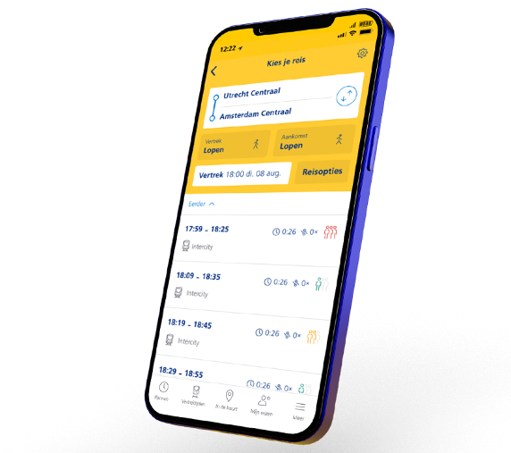

# Deel 1 - Introductie AI algoritmes


<p style="margin-bottom:300px"></p>

## Prediction



De NS app voorspelt hoe druk je reis gaat worden. Deze voorspelling wordt gedaan door een AI algoritme dat is getraind op data. Die data kan zijn:

- **Historische reizigersdata** - Aantallen passagiers per moment, dag en route van voorgaande jaren
- **Dag van de week** - Maandag drukker dan zondag, verschillende patronen per weekdag
- **Seizoen en vakantieperiodes** - Zomervakantie, kerstvakantie, meivakantie hebben piekbelasting
- **Evenementen** - Concerten, voetbalwedstrijden, festivals trekken extra reizigers
- **Weer** - Regen of mooi weer beïnvloedt aantal fietsers dat omgestapt is
- **Spitsuren** - Ochtendspits (7-9u) en avondspits (17-19u) hebben voorspelbare pieken
- **Schoolkalender** - Schooldagen vs. weekenden, examenseizoen
- **Publieke feestdagen** - 5 mei, sinterklaas, nieuwjaarsdag hebben specifieke patronen
- **Werkdagen vs. thuiswerken** - Post-COVID verschuiving in werkpatronen
- **Treintype en route** - Intercity's naar grote steden voller dan lokale treinen
- **Onvoorziene omstandigheden** - Treinstakingen, ongevallen, wegwerkzaamheden op parallelle routes


<p style="margin-bottom:300px"></p>


<br><br><br>

## Predictive, Generative en Agentic AI

| Predictive AI | Generative AI | Agentic AI |
|---|---|---|
| Drukte in de trein | Text generation | Autonomous customer support |
| Broeikas Ecosysteem | Image generation | Code debugging en testing |
| Thuisbezorgd drukte | Code generation | Financial trading |
| Tekst herkenning | Music generation  | Autonomous research |
| Email spam | Video generation | IT infrastructure management |
| House price prediction | | |
| Credit card fraude | | |
| Medical diagnosis | | |
| Pose herkenning | | |


<p style="margin-bottom:300px"></p>


## AI algoritmes en traditionele algoritmes

Traditionele algoritmes kan je zien als `if else` statements. De developer bedenkt de logica, en bedenkt wanneer er wat moet gebeuren in de flow van een programma.

```js
if(health < 1) {
  label = "player is defeated"
}
if(health > 0) {
  label = "player is alive"
}
```

In AI algoritmes wordt (meestal) een model *getraind* met data. Dit model leert dan begrijpen wat de labels zijn voor de verschillende waarden.

```js
let data = [
  {value:0, label: "defeated"},
  {value:-2, label: "defeated"},
  {value:3, label: "alive"},
  {value:9, label: "alive"},
]

model.learn(data)
```

Als je genoeg data levert, kan het model ***leren*** welke waarden "defeated" zijn en welke "alive"

Vervolgens kan je nieuwe waarden voorleggen en vragen wat hiervan het label is:

```js
label = model.classify(-5) // defeated! (0.87)
```

### Confidence 

Een eigenschap van het doen van een voorspelling is dat die nooit 100% zeker is. Een voorspelling krijgt een *confidence* score: hoe zeker is het algoritme. Voor bovenstaand voorbeeld zou dat zijn:

| Waarde | Voorspelling | Confidence |
|--------|--------------|------------|
| -4 | defeated | 0.95 |
| -3 | defeated | 0.92 |
| -2 | defeated | 0.88 |
| -1 | defeated | 0.75 |
| 0 | defeated | 0.65 |
| 1 | alive | 0.60 |
| 2 | alive | 0.78 |
| 3 | alive | 0.85 |
| 4 | alive | 0.93 |


> *Vraag: wanneer is een confidence hoog genoeg, en hoe zou je die kunnen verbeteren?*

> *Vraag: bij het IF statement weet je altijd 100% zeker dat het klopt, dus waarom zou je een AI algoritme gebruiken?*


<p style="margin-bottom:300px"></p>


## Datasets

Een "real world" dataset is vaak veel complexer dan slechts 1 of 2 getallen. Dat maakt het lastig om er een patroon in te herkennen. Een AI algoritme kan je net zo lang *trainen* totdat het wel een patroon heeft gevonden!

- [Puma Indians Dataset](https://www.kaggle.com/datasets/uciml/puma-indians-diabetes-database) - Diabetes voorspellen op basis van medische metingen
- [House Prices](https://www.kaggle.com/c/house-prices-advanced-regression-techniques) - Huizenprijzen voorspellen aan de hand van 79 eigenschappen van een huis
- [MNIST](http://yann.lecun.com/exdb/mnist/) - Handgeschreven cijfers herkennen
- [UCI Repository](https://archive.ics.uci.edu/ml/) en [Google Dataset Search](https://datasetsearch.research.google.com/) - Honderden datasets voor diverse machine learning problemen

<p style="margin-bottom:300px"></p>


## Algoritmes

- **Cosine Similarity** - Klein en snel algoritme dat snel kan zien hoeveel twee getallenreeksen overeenkomen
- **Decision Trees** - Eenvoudig model dat data verdeelt in ja/nee vragen
- **K-Nearest Neighbors (KNN)** - Classificeert data op basis van dichtstbijzijnde punten
- **Linear Regression** - Voorspelt waarden door een lijn door data te trekken
- **Neural Networks** - Geïnspireerd op hersenen, met lagen neuronen
- **Convolutional Neural Networks (CNN)** - Neural network voor afbeeldingen
- **Transformer** - AI model dat een grote hoeveelheid data tegelijkertijd kan analyseren, werkt goed voor taal

<br>

- [Deel 2 - Maak je eigen recommender system](./recommender.md) 
