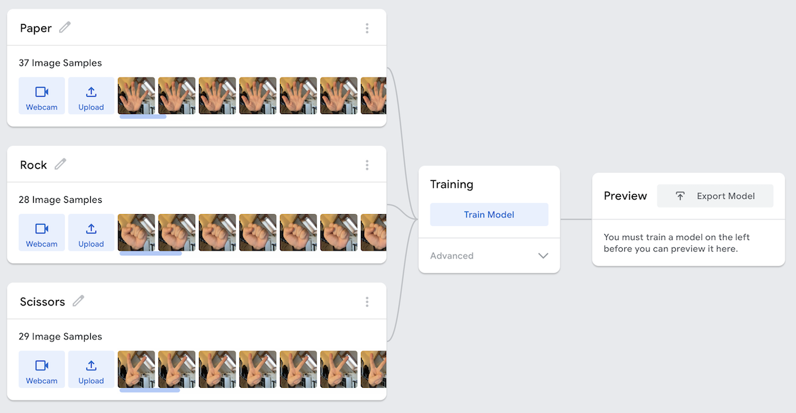
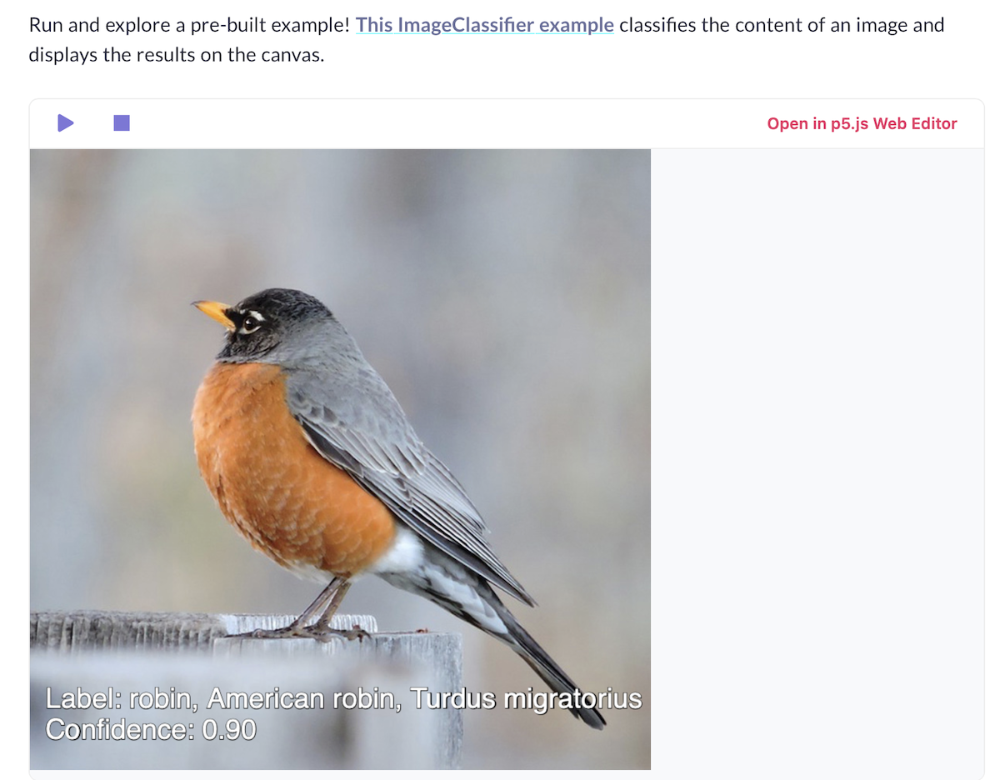

# Deel 3 - AI libraries

Het doel van deze korte toelichting is om je een startpunt te geven met het werken met online AI libraries voor het werken met data. Je kan zelf een keuze maken afhankelijk van je interesse.

> *Deze workshop gaat voornamelijk over **Predictive AI**, dus niet over het werken met generatieve taalmodellen zoals ChatGPT, Claude en Gemini. Dat volgt nog in een latere les!*

<br>

| Library | Beschrijving |
|---------|-------------|
| [HuggingFace transformers](#huggingface) | Download open source AI modellen voor eenvoudige *tekst herkenning* |
| [Teachable Machine](#teachable-machine) | Maak een AI model dat *afbeeldingen en lichaamsposes* kan herkennen (zonder code!) |
| [ML5](#ml5) | JavaScript library die AI-modellen vereenvoudigt voor *web-applicaties* |
| [TensorFlow](#tensorflow) | Krachtig framework om je eigen *neural network* te ontwerpen in javascript |

<br><br><br>

## HuggingFace Transformers

De [huggingface transformers.js](https://huggingface.co/docs/transformers.js/en/index) library geeft je een [heleboel opties](https://huggingface.co/docs/transformers.js/en/index#tasks) voor het werken met *eenvoudige* AI modellen. In de meeste gevallen wordt een bestaand AI model rechtstreeks naar je browser gedownload (*en in de `cache` geplaatst*). 

<br>

### Tekst als vector

Je kan een ***taalmodel*** gebruiken om teksten om te zetten naar ***vectoren*** (een array van getallen). Nu kan je de [cosine similarity](./recommender.md) uit opdracht 1 gebruiken om te zien of hoeveel twee teksten op elkaar lijken!

```sh
npm install @huggingface/transformers
```

```js
import { pipeline } from '@huggingface/transformers'
import { cosineSimilarity } from "./ai.js"

const languageModel = await pipeline('feature-extraction', 'Xenova/all-MiniLM-L6-v2')

const word1 = await languageModel('cats are so cool', { pooling: 'mean', normalize: true })  //"cls" pooling may be even better for long sentences
const word2 = await languageModel('i drive to work every day', { pooling: 'mean', normalize: true })

console.log(word1.data) // 384 numbers
console.log(word2.data) // 384 numbers

let sim = cosineSimilarity(word1.data, word2.data)
console.log(`Text similarity is ${sim}`)
```
> *Het MiniLM-L6 model is geschikt om hele zinnen te vergelijken, "pooling" bepaalt hoe het gemiddelde berekend wordt.*

<br>

### Text Sentiment

Herken sentiment in een tekst - is dit een positieve of negatieve review?

```js
const classifier = await pipeline('sentiment-analysis');
const results = await classifier('Wow, the teachers at CMGT are so cool 🥰!');

console.log(`This review is ${results[0].label}, I am ${(results[0].score * 100).toFixed(2)}% sure.`)
```

#### Meer mogelijkheden:

Geef labels aan een tekst, Vertaal een tekst, Vat een tekst samen, Verwijder de achtergrond uit een plaatje, Vertel wat er op een afbeelding of video staat.

<br><br><br>

## Teachable Machine



[Teachable Machine](https://teachablemachine.withgoogle.com) is een project van google, waarbij je in een een user interface een AI model kan *trainen* om webcam beelden te herkennen. In bovenstaand voorbeeld leert het model om "rock", "paper", "scissors" te herkennen in een webcam beeld.

Vervolgens kan je het model downloaden naar jouw eigen app zodat de beeldherkenning daar kan plaatsvinden.

Ook hier draait het uiteindelijke model op de machine van de eindgebruiker, waardoor er *geen* data wordt verstuurd van de eindgebruiker naar een AI server. Het *trainen* van het model gebeurt echter wel op de servers van google.


<br><br><br>

## ML5

[ml5.js](https://docs.ml5js.org/) is een AI library met als doel om het werken met AI algoritmes wat gebruiksvriendelijker te maken, en meer geschikt voor creatieve projecten. Het wordt vaak samen gebruikt met [p5.js](https://p5js.org), een javascript tool voor creatives.

In dit voorbeeld kan de AI herkennen wat er op een afbeelding te zien is. Je kan ook tools bouwen voor lichaamspose herkenning, gezichtsuitdrukking, geluid en sentiment herkenning.



<br>

```html
<script src="https://unpkg.com/ml5@latest/dist/ml5.min.js"></script>
```

```js
const img = document.querySelector('img');       // existing image on the html page
const classifier = await ml5.imageClassifier('MobileNet');
const results = await classifier.classify(img);
console.log(results);
```

<br><br><br>

## TensorFlowJS

[TensorFlow](https://www.tensorflow.org/js) is een professionele AI library om geavanceerde modellen te trainen. Net zoals in het "Recommender" voorbeeld, geef je data en labels aan het model, waarna het model dit leert te herkennen. Een neural network is erg goed in het vinden van complexe patronen in grote hoeveelheden data.


Het werken met tensorflow is een heel vakgebied, als je hier mee aan de slag wil is het goed om hier een extra speedcourse voor aan te vragen.

Je kan echter wel met de basis code snel een model maken die een waarde kan voorspellen. Dit voorbeeld voorspelt de huurprijs van een studentenkamer, gebaseerd op bestaande prijzen per vierkante meter.

#### Laad tensorflow in de browser

```html
<script src="https://cdn.jsdelivr.net/npm/@tensorflow/tfjs@latest"> </script>
```
#### Voeg je data toe
```js
// xData zijn het aantal vierkante meters van zes studentenkamers
// yData zijn de huurprijzen van die kamers
const xData = [5, 10, 15, 20, 25, 30];
const yData = [100, 200, 350, 500, 700, 1000];
```
De code voor het neural network kan je copy pasten:
```js
const yNormalized = yData.map(y => y / 1000);
const xs = tf.tensor2d(xData, [xData.length, 1]);
const ys = tf.tensor2d(yNormalized, [yNormalized.length, 1]);

const model = tf.sequential();
model.add(tf.layers.dense({ units: 1, inputShape: [1] }));
model.compile({loss: 'meanSquaredError', optimizer: tf.train.adam(0.1)});
```
Vervolgens start je het trainingproces, en als dat klaar is kan je een voorspelling doen:
```js
// training
console.log("Start training...");
await model.fit(xs, ys, { epochs: 100 });
console.log("Finished training");

// predicting
const result = model.predict(tf.tensor2d([18], [1, 1])).dataSync();
console.log("Een kamer van 18m2 kost per maand: €" + (result[0] * 1000).toFixed(0));
```
