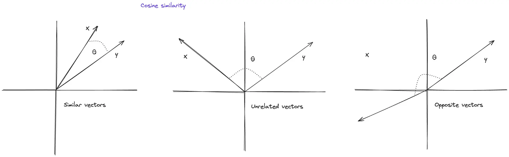
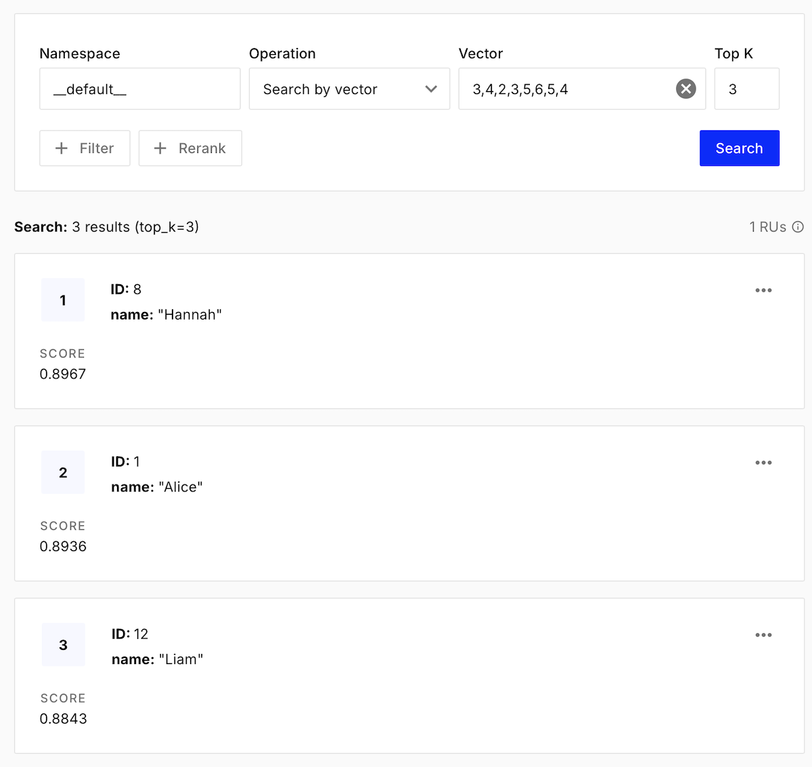
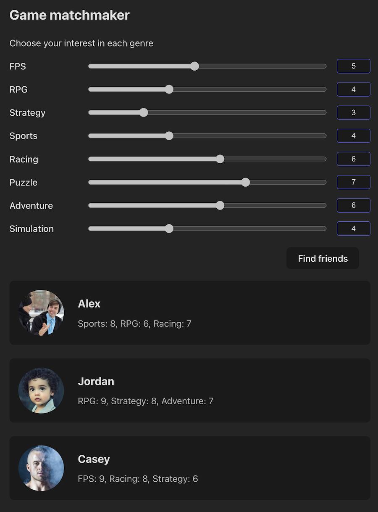

# Deel 2 - Maak je eigen recommender system

- [Wat is een recommender system](#wat-is-een-recommender-system)
- [Een database gebruiken](#real-world-example)
- [Bouw een UI](#bouw-een-ui)

<br><br><br>

# Wat is een recommender system

> *Ik hou van FPS shooters, en Racing games. Wie van mijn mede studenten past het best bij mij?*

Een recommender system kan een match maken tussen jou en de meest waarschijnlijke matches, gebaseerd op een hoeveelheid data.

## Data

In de introductie hebben we gezien dat een dataset vaak bestaat uit een label en een array van getallen. Hieronder vind je een fictieve tabel van studenten en hun gaming interesses. Een 1 betekent geen interesse, een 10 betekent dat dit het favoriete genre is van die student. 

*Je kan deze tabel ook aanpassen voor andere onderwerpen, zoals sport, filmgenres, muziek artiesten, studie vakken of een dating app.*


| Student | FPS | RPG | Strategy | Sports | Racing | Puzzle | Adventure | Simulation |
|---------|-----|-----|----------|--------|--------|--------|-----------|------------|
| Alice   | 9   | 5   | 3        | 2      | 6      | 4      | 7         | 3          |
| Ben     | 3   | 8   | 7        | 1      | 2      | 6      | 8         | 5          |
| Chloe   | 2   | 9   | 8        | 1      | 1      | 7      | 6         | 8          |
| David   | 7   | 4   | 3        | 8      | 9      | 2      | 5         | 3          |
| Ethan   | 8   | 2   | 2        | 9      | 8      | 1      | 4         | 2          |
| Fiona   | 1   | 8   | 9        | 2      | 1      | 8      | 7         | 9          |
| George  | 6   | 3   | 2        | 10     | 9      | 1      | 3         | 2          |
| Hannah  | 2   | 9   | 7        | 1      | 3      | 8      | 9         | 7          |
| Iris    | 3   | 7   | 8        | 2      | 1      | 9      | 8         | 8          |
| Jack    | 9   | 3   | 2        | 7      | 8      | 2      | 5         | 3          |
| Kim     | 1   | 10  | 9        | 1      | 1      | 9      | 8         | 9          |
| Liam    | 7   | 4   | 3        | 8      | 7      | 3      | 5         | 4          |

<br><br><br>

## Algoritme



Het `cosine similarity` algoritme bekijkt een array van data als een *angle*. In deze afbeelding bestaat de array uit twee cijfers (`x` en `y`). Van twee arrays berekent het in hoeverre die angles dezelfde kant op wijzen. Een `similarity` van `1` betekent dat de data volledig overeenkomt, en `-1` betekent dat de data exact tegenovergesteld is. Als alle data positieve getallen bevat, dan is `0` de laagste waarde.

> *⚠️ De array mag uit meer cijfers bestaan dan alleen `x` en `y`*

#### Code

Maak een nieuw bestand `recommender.js` en plaats het Cosine Similarity algoritme er in! Dit kan je copy>pasten:

```js
function cosineSimilarity(arrayA, arrayB) {
  const dotProduct = arrayA.reduce((sum, val, i) => sum + val * arrayB[i], 0);
  const magA = Math.sqrt(arrayA.reduce((sum, val) => sum + val * val, 0));
  const magB = Math.sqrt(arrayB.reduce((sum, val) => sum + val * val, 0));
  return dotProduct / (magA * magB); 
}
```

#### Test 1

Test een aantal arrays om te zien hoeveel ze overeenkomen. Let op dat onze data geen negatieve getallen bevat, dus `0` zou de laagste `similarity` score moeten zijn.

> *⚠️ beide arrays moeten altijd evenveel getallen bevatten*

```js
let resultA = cosineSimilarity([4,5,1,2], [5,4,2,3])
let resultB = cosineSimilarity([4,5,1,2], [1,0,8,9])
```

#### Data 

Je kan de studenten data tabel omzetten naar javascript, meestal doe je dat door objecten te maken met een label en een scores array:

```js
const students = [
  { name: 'Alice', scores: [9, 5, 3, 2, 6, 4, 7, 3] },
  { name: 'Ben', scores: [3, 8, 7, 1, 2, 6, 8, 5] },
  { name: 'Chloe', scores: [2, 9, 8, 1, 1, 7, 6, 8] },
  { name: 'David', scores: [7, 4, 3, 8, 9, 2, 5, 3] },
  { name: 'Ethan', scores: [8, 2, 2, 9, 8, 1, 4, 2] },
  { name: 'Fiona', scores: [1, 8, 9, 2, 1, 8, 7, 9] },
  { name: 'George', scores: [6, 3, 2, 10, 9, 1, 3, 2] },
  { name: 'Hannah', scores: [2, 9, 7, 1, 3, 8, 9, 7] },
  { name: 'Iris', scores: [3, 7, 8, 2, 1, 9, 8, 8] },
  { name: 'Jack', scores: [9, 3, 2, 7, 8, 2, 5, 3] },
  { name: 'Kim', scores: [1, 10, 9, 1, 1, 9, 8, 9] },
  { name: 'Liam', scores: [7, 4, 3, 8, 7, 3, 5, 4] }
]
```

#### Test 2

Vergelijk twee studenten met elkaar! Kan je vinden wie het meest overeenkomen?

<br><br><br>

## Recommendations

Met het AI algoritme gaan we kijken welke studenten het dichtst bij jouw eigen interesse liggen:

```js
const myScores = [7, 4, 3, 8, 7, 3, 5, 4]
for (const student of students) {
    console.log(`${student.name} similarity: ${cosineSimilarity(student.scores, myScores)}`)
}
```

#### Opdracht

Verbeter de code door alleen de top 3 studenten met de beste matches te tonen!


<br><br><br>

# Real World Example

Je hebt gezien dat de gegevens van een student opgeslagen wordt als een reeks getallen. Dit noemen we een [Vector](https://en.wikipedia.org/wiki/Vector_(mathematics_and_physics)). In de echte wereld heeft een dataset duizenden of tienduizenden users, en ook de vector array per user kan honderden kolommen hebben. Als we hier met een `for of` loop doorheen gaan, dan wordt je systeem erg traag.

Er zijn speciale databases om met zulke hoeveelheden vector data efficiënt te werken, zoals: [Pinecone](https://www.pinecone.io), [Qdrant](https://qdrant.tech) en [Weaviate](https://weaviate.io).

## Pinecone Vector Search

1 - Maak een [Pinecone](https://www.pinecone.com) account.

- Maak een nieuwe API key en noteer die op een veilige plek *-let op, je kan de key achteraf niet meer inzien in het dashboard-*
- Maak een *index* met de naam `gaming-buddies`
- Je hoeft hier ***geen*** taalmodel te selecteren. Kies ***manual*** en geef de tabel 8 kolommen *(het aantal gaming voorkeuren)*

```sh
Dimension: 8
Metric: cosine
Vector type: Dense
```


<br><br><br>

2 - Maak een nieuw [Node](https://nodejs.org/en) project met `npm init` en installeer Pinecone. We werken in de *backend*, dus er is nu nog geen `index.html` of `style.css`.

```js
npm install @pinecone-database/pinecone
```

<br><br><br>

3 - Maak een nieuw bestand `upload.js`. Hiermee ga je de data uploaden naar pinecone. 

> *⚠️ Let op dat de students nu ook een `id` nodig hebben!*

```js
import { Pinecone } from '@pinecone-database/pinecone'

const pine = new Pinecone({ apiKey: 'YOUR_PINECONE_API_KEY' })
const index = pine.Index('gaming-buddies')

const students = [
  { id: '1', name: 'Alice', scores: [9, 5, 3, 2, 6, 4, 7, 3] }, // id toegevoegd
  { id: '2', name: 'Ben', scores: [3, 8, 7, 1, 2, 6, 8, 5] },
  // ... 
]

await index.upsert(
  students.map(student => ({
    id: student.id,
    values: student.scores,
    metadata: { name: student.name }
  }))
)
```
Voer het uit met

```sh
node upload.js
```

<br><br><br>

4 - In je pinecone dashboard kan je zien of het uploaden geslaagd is. Om te testen kan je in het dashboard al zoeken naar related students!



<br><br><br>

5 - Maak een nieuw bestand `search.js`. Hierin gaan we zoeken naar de meest geschikte matches met vector similarity search!

```js
import { Pinecone } from '@pinecone-database/pinecone'

const pine = new Pinecone({ apiKey: 'YOUR_PINECONE_API_KEY' })
const index = pine.Index('gaming-buddies')

const myScores = [7, 4, 3, 8, 7, 3, 5, 4]
const results = await index.query({
  vector: myScores,
  topK: 3,
  includeMetadata: true
})

console.log('Jouw top 3 gaming buddies:')
for (const match of results.matches) {
  console.log(`${match.metadata.name} (score: ${match.score.toFixed(2)})`)
}
```
Voer de code uit met `node search.js`

Het voordeel van Pinecone is dat *similarity search* is ingebouwd en snel blijft werken zelfs als je tienduizend studenten hebt. Je hoeft dus niet meer zelf de `similarity search` functie aan te roepen!


<br><br><br>

# Bouw een UI

Gefeliciteerd! Je hebt een AI algoritme geleerd, en een online database gebouwd om recommendations mee te doen! Wat nu nog mist is een frontend. Voeg `index.html`, `app.js` en `style.css` toe aan de `public` map. Daarin ga je het UI ontwerp maken. Hieronder zie je een voorbeeld:



<br>

Deel je project als volgt in:

```
gaming-buddies/
   ├── node_modules/
   ├── server.js
   ├── search.js
   ├── upload.js
   └── public/
       ├── index.html
       ├── app.js
       └── style.css
```
Gebruik je kennis uit ***PRG6 - REST API's*** voor de volgende stappen:

#### Frontend ontwerpen

- In `server.js` kan je `express` toevoegen met `npm install express`.
- In `server.js` maak je de public map visible met `app.use(express.static('public'))`
- Bekijk `index.html` op `localhost:3000`. Nu kan je de UI gaan ontwerpen!
- Maak sliders voor de interesses, een submit button, en cards voor de resultaten.

#### Server POST request

- In `server.js` maak je een `POST` request die de student data ontvangt, dit zijn 8 getallen. De route kan zijn `localhost:3000/api/search/` 
- De server roept de `search` functie aan die in Pinecone zoekt. Het resultaat stuur je terug naar de client als `JSON`.

#### Resultaat tonen

- In `public/app.js` maak je een `fetch` call naar je endpoint. Daarin geef je de 8 scores mee van de sliders in de UI.
- De JSON die daaruit terugkomt toon je aan de gebruiker als 3 cards.