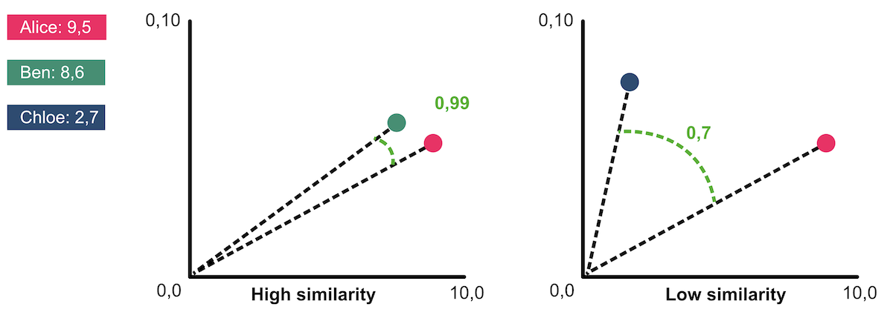

# Deel 2 - Maak je eigen recommender system

- [Recommender system bouwen](#wat-is-een-recommender-system)
- [Real World Example](#real-world-example)
- [User Interface](#user-interface)

<br><br><br><br><br><br>

# Wat is een recommender system

> *Ik hou van FPS shooters, en Racing games. Wie van mijn mede studenten past het best bij mij?*

Een recommender system kan een match maken tussen jou en de meest waarschijnlijke matches, gebaseerd op een hoeveelheid data.

## Data

In de introductie hebben we gezien dat een dataset vaak bestaat uit een label en een array van getallen. Hieronder vind je een fictieve tabel van studenten en hun gaming interesses. Een 1 betekent geen interesse, een 10 betekent dat dit het favoriete genre is van die student. 

*Je kan deze tabel ook aanpassen voor andere onderwerpen, zoals sport, filmgenres, muziek artiesten, studie vakken of een dating app.*


| Student | FPS | RPG | Strategy | Sports | Racing | Puzzle | Adventure | Simulation |
|---------|-----|-----|----------|--------|--------|--------|-----------|------------|
| Alice   | 9   | 5   | 3        | 2      | 6      | 4      | 7         | 3          |
| Ben     | 3   | 8   | 7        | 1      | 2      | 6      | 8         | 5          |
| Chloe   | 2   | 9   | 8        | 1      | 1      | 7      | 6         | 8          |
| David   | 7   | 4   | 3        | 8      | 9      | 2      | 5         | 3          |
| Ethan   | 8   | 2   | 2        | 9      | 8      | 1      | 4         | 2          |
| Fiona   | 1   | 8   | 9        | 2      | 1      | 8      | 7         | 9          |
| George  | 6   | 3   | 2        | 10     | 9      | 1      | 3         | 2          |
| Hannah  | 2   | 9   | 7        | 1      | 3      | 8      | 9         | 7          |
| Iris    | 3   | 7   | 8        | 2      | 1      | 9      | 8         | 8          |
| Jack    | 9   | 3   | 2        | 7      | 8      | 2      | 5         | 3          |
| Kim     | 1   | 10  | 9        | 1      | 1      | 9      | 8         | 9          |
| Liam    | 7   | 4   | 3        | 8      | 7      | 3      | 5         | 4          |

<br><br><br><br><br><br>

## Algoritme



Het [cosine similarity](https://alexop.dev/posts/how-to-implement-a-cosine-similarity-function-in-typescript-for-vector-comparison/#visualizing-cosine-similarity) algoritme bekijkt data als een *richting* (vector). Van twee vectoren berekent het in hoeverre die dezelfde kant op wijzen. Dit geeft een getal van `1` (helemaal gelijk) tot `0` (helemaal verschillend).

### Code

Maak een nieuw bestand `recommender.js` en plaats het Cosine Similarity algoritme er in! Dit kan je copy>pasten:

```js
function cosineSimilarity(arrayA, arrayB) {
  const dotProduct = arrayA.reduce((sum, val, i) => sum + val * arrayB[i], 0);
  const magA = Math.sqrt(arrayA.reduce((sum, val) => sum + val * val, 0));
  const magB = Math.sqrt(arrayB.reduce((sum, val) => sum + val * val, 0));
  return dotProduct / (magA * magB); 
}
```

<br><br><br><br><br><br>

# Recommender bouwen

## Opdracht 1

Om te zien hoe het algoritme werkt, vergelijk je twee willekeurige arrays met elkaar. De ***Similarity*** van die twee arrays ligt altijd tussen `0` (heel verschillend) en `1` (heel erg gelijk). 

> *Je data bevat geen negatieve getallen. De arrays moeten altijd evenveel getallen bevatten.*

```js
let resultA = cosineSimilarity([4,5,1,2], [5,4,2,3])     // hoge similarity
let resultB = cosineSimilarity([4,5,1,2], [1,0,8,9])     // lage similarity
```

## Opdracht 2

Vergelijk nu de game voorkeuren van twee studenten met elkaar. Om dat te kunnen doen is het handig om eerst de data in javascript beschikbaar te maken:

```js
const students = [
  { name: 'Alice', scores: [9, 5, 3, 2, 6, 4, 7, 3] },
  { name: 'Ben', scores: [3, 8, 7, 1, 2, 6, 8, 5] },
  { name: 'Chloe', scores: [2, 9, 8, 1, 1, 7, 6, 8] },
  { name: 'David', scores: [7, 4, 3, 8, 9, 2, 5, 3] },
  { name: 'Ethan', scores: [8, 2, 2, 9, 8, 1, 4, 2] },
  { name: 'Fiona', scores: [1, 8, 9, 2, 1, 8, 7, 9] },
  { name: 'George', scores: [6, 3, 2, 10, 9, 1, 3, 2] },
  { name: 'Hannah', scores: [2, 9, 7, 1, 3, 8, 9, 7] },
  { name: 'Iris', scores: [3, 7, 8, 2, 1, 9, 8, 8] },
  { name: 'Jack', scores: [9, 3, 2, 7, 8, 2, 5, 3] },
  { name: 'Kim', scores: [1, 10, 9, 1, 1, 9, 8, 9] },
  { name: 'Liam', scores: [7, 4, 3, 8, 7, 3, 5, 4] }
]
```
## Opdracht 3

Beschrijf je eigen gaming voorkeur ook in een array. Gebruik nu een `for` loop om voor elke andere student een similarity score te tonen.

```js
// FPS,RPG,Strategy,Sports,Racing,Puzzle,Adventure,Simulation
const myScores = [7, 4, 3, 8, 7, 3, 5, 4]
for (const student of students) {
    //...similarity van student en jouw eigen scores
}
```

## Opdracht 4

Toon alleen de top 3 studenten met de beste match!

<br><br><br><br><br><br>

# Hidden Bias

De recommender van Spotify kijkt niet alleen naar jouw eigen voorkeuren, maar weegt ook andere factoren mee. Wellicht kijken ze zelfs naar hoeveel Spotify er zelf aan verdient als jij een bepaalt nummer afspeelt. Dit noemen we *hidden bias*.

## Opdracht 5

Bouw een *hidden bias* in de game recommender. Dit zijn studenten die jou betalen om vaker als game buddy aangeraden te worden. Maak een extra kolom per student waar ze een score van 10 krijgen als dit zo is. De andere studenten krijgen een score van 0. 

Bij het zoeken naar de beste matches, geef je de `user` ook een extra kolom van 10, zodat die user meer overeenkomt met de betalende studenten.


<br><br><br><br><br><br>

# Real World Example

Je hebt gezien dat de data van een student opgeslagen wordt als een reeks getallen. Dit noemen we een [Vector](https://en.wikipedia.org/wiki/Vector_(mathematics_and_physics)). In de echte wereld heeft een dataset duizenden of tienduizenden users, en ook de vector array per user kan honderden kolommen hebben. Als we hier met een `for of` loop doorheen gaan, dan wordt je systeem erg traag.

Er zijn speciale databases om met zulke hoeveelheden vector data efficiënt te werken, zoals: [Pinecone](https://www.pinecone.io), [Qdrant](https://qdrant.tech) en [Weaviate](https://weaviate.io).

<br>

## Pinecone Vector Search

### Account

Maak een [Pinecone](https://www.pinecone.com) account.

- Maak een nieuwe API key en noteer die op een veilige plek *-let op, je kan de key achteraf niet meer inzien in het dashboard-*
- Maak een *index* met de naam `gaming-buddies`
- Je hoeft hier ***geen*** taalmodel te selecteren. Kies ***manual*** en geef de tabel 8 kolommen *(het aantal gaming voorkeuren)*

```sh
Dimension: 8
Metric: cosine
Vector type: Dense
```
<br>

### Node

Maak een nieuw [Node](https://nodejs.org/en) project met `npm init` en installeer Pinecone. We werken in de *backend*, dus er is nu nog geen `index.html` of `style.css`.

```js
npm install @pinecone-database/pinecone
```
<br>

### Uploaden

Maak een nieuw bestand `upload.js`. Hiermee ga je de data uploaden naar pinecone. 

> *⚠️ Let op dat de students nu ook een `id` nodig hebben!*

```js
import { Pinecone } from '@pinecone-database/pinecone'

const pine = new Pinecone({ apiKey: 'YOUR_PINECONE_API_KEY' })
const index = pine.Index('gaming-buddies')

const students = [
  { id: '1', name: 'Alice', scores: [9, 5, 3, 2, 6, 4, 7, 3] }, // id toegevoegd
  { id: '2', name: 'Ben', scores: [3, 8, 7, 1, 2, 6, 8, 5] },
  // ... 
]

await index.upsert(
  students.map(student => ({
    id: student.id,
    values: student.scores,
    metadata: { name: student.name }
  }))
)
```
Voer het uit met

```sh
node upload.js
```
<br>

### Search

In je pinecone dashboard kan je zien of het uploaden geslaagd is. *Om te testen kan je in het dashboard al zoeken naar related students!*

<br>

Maak een nieuw bestand `search.js`. Hierin gaan we zoeken naar de meest geschikte matches met vector similarity search!

```js
import { Pinecone } from '@pinecone-database/pinecone'

const pine = new Pinecone({ apiKey: 'YOUR_PINECONE_API_KEY' })
const index = pine.Index('gaming-buddies')

const myScores = [7, 4, 3, 8, 7, 3, 5, 4]
const results = await index.query({
  vector: myScores,
  topK: 3,
  includeMetadata: true,
  includeValues: true
})

console.log('Jouw top 3 gaming buddies:')
for (const match of results.matches) {
  console.log(`${match.metadata.name}, Rank: ${match.score.toFixed(2)})`)
  console.log(`Scores: ${match.values}`)
}
```
Voer de code uit met `node search.js`

Het voordeel van Pinecone is dat *similarity search* is ingebouwd en snel blijft werken zelfs als je tienduizend studenten hebt. Je hoeft dus niet meer zelf de `similarity search` functie aan te roepen!

> ⚠️ *Als je geen pinecone account kan of wil maken, dan kan je meteen doorgaan met de User Interface opdracht. Je kan de vector search gebruiken van opdracht 1 t/m 5, in plaats van pinecone*.


<br><br><br><br><br><br>

# User Interface

Je hebt een AI algoritme gebouwd, en een online database om recommendations mee te doen! Wat nu nog mist is een frontend. Voeg `index.html`, `app.js` en `style.css` toe aan de `public` map. Daarin ga je het UI ontwerp maken. Hieronder zie je een voorbeeld:


<br>

#### Project indeling

Gebruik je kennis uit ***PRG6 - REST API's*** voor de volgende stappen.

```
gaming-buddies/
   ├── node_modules/
   ├── server.js
   ├── search.js
   ├── upload.js
   └── public/
       ├── index.html
       ├── app.js
       └── style.css
```

<br>

## Server

- Maak een `server.js` en installeer `npm install express`. 
- Maak de `public` map zichtbaar. Nu kan je `index.html` zien op `localhost:3000`
- Maak een `POST` request die de student data ontvangt, dit zijn 8 getallen. De route is `localhost:3000/api/search/`. 
- Vanuit het POST request zoek je in Pinecone. Het resultaat stuur je terug als `JSON`.

```js
import express from 'express'
const app = express()
app.use(express.json())
app.use(express.static('public'))

app.post('/api/search', async (req, res) => {
  const results = //..search pinecone
  res.json(results);
})

app.listen(3000, () => console.log(`Server running on http://localhost:3000`))
```

<br>

## Frontend

- Maak sliders voor de interesses, een submit button, en cards voor de resultaten.
- In `public/app.js` maak je een `fetch` call naar je `./api/search/` . Daarin geef je de 8 scores mee van de sliders in de UI.
- De JSON die daaruit terugkomt toon je aan de gebruiker als 3 cards.

```js
const response = await fetch('/api/search', {
  method: 'POST',
  headers: { 'Content-Type': 'application/json' },
  body: JSON.stringify({ userScores:[0,2,1,5,3,3,5,8] })
});
```